# The Story of Modern Software Architecture (1999–2025)

> _“Architecture is the art of designing the future.”_ – Adapted from Grady Booch. If you are a junior developer who has ever wondered why your daily work involves containers, cloud consoles, sprint reviews, or chatty bots that write code with you, this guide is your time machine. We will walk year by year through the past quarter century, meet the people behind the buzzwords, and unpack the architectural ideas that quietly shape every pull request you open.

---

## How to Read This Journey

> [!TIP]
> You can treat this timeline like a choose-your-own adventure. Skim the highlights, then dive deeper using the call-outs, code snippets, and diagrams sprinkled throughout.

* **Audience.** Curious developers with basic programming experience but little knowledge of how modern software practices emerged.
* **Narrative approach.** Each era begins with the cultural backdrop, then dives into architectural patterns, enabling technologies, influential people, and delightful trivia.
* **Goal.** By the end, you will understand _why_ we build systems the way we do in 2025 and how today’s choices echo experiments from decades past.

For quick navigation:

1. [Setting the Stage: 1990s Foundations](#setting-the-stage-1990s-foundations)
2. [2000–2004: Processes Go Agile, Services Go Online](#2000-2004-processes-go-agile-services-go-online)
3. [2005–2009: Web 2.0, Rails, and the Dawn of the Cloud](#2005-2009-web-20-rails-and-the-dawn-of-the-cloud)
4. [2010–2014: DevOps, Microservices, and the Container Craze](#2010-2014-devops-microservices-and-the-container-craze)
5. [2015–2019: Cloud-Native Maturity and the Age of Observability](#2015-2019-cloud-native-maturity-and-the-age-of-observability)
6. [2020–2025: AI Everywhere, Edge Computing, and Responsible Tech](#2020-2025-ai-everywhere-edge-computing-and-responsible-tech)
7. [Putting It All Together: Key Patterns and Timeless Lessons](#putting-it-all-together-key-patterns-and-timeless-lessons)
8. [Suggested Films, Books, and Talks for Further Exploration](#suggested-films-books-and-talks-for-further-exploration)
9. [Glossary of Core Terms](#glossary-of-core-terms)

---

## Setting the Stage: 1990s Foundations

Picture an office in 1999. Developers are wearing pagers, deployment means burning CDs, and a single “release engineer” physically swaps servers at midnight. The dominant architecture is the **monolith**: a single, large executable containing user interface, business logic, and data access layers. Updating a tiny feature often requires redeploying the whole beast.

### Architectural Baseline

| Pattern | What It Meant in Practice | Pain Points |
| --- | --- | --- |
| **Client–Server / 3-Tier** | Presentation (UI) tier, application tier, and database tier deployed as one unit. | Tight coupling meant scaling the UI required scaling the entire stack. |
| **Layered Architecture** | Code organized into layers (UI, domain, infrastructure). Inspired by books like _Design Patterns_. | Good for clarity, but deployments were still monolithic. |
| **Component Object Models (COM, CORBA)** | Early attempts at reusable software components communicating over binary protocols. | Tooling complexity and vendor lock-in limited adoption. |

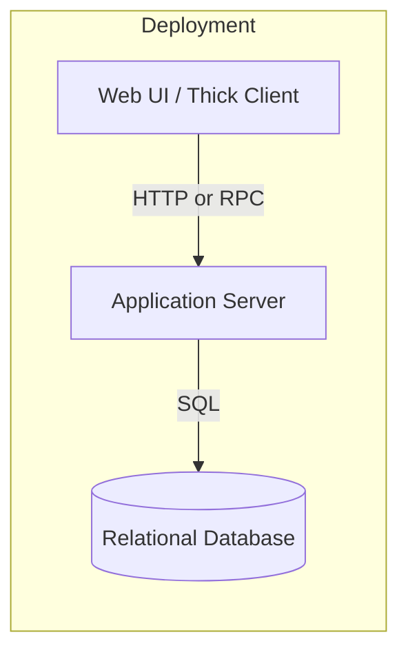

> [!NOTE]
> The “monolith” label often masked disciplined layering. Many teams in the 1990s already practiced clean separation of concerns; the challenge was that everything still shipped together on one weekend release train.

### People and Ideas Setting the Tone

* **Mary Shaw and David Garlan** introduced _software architecture_ as its own discipline in their 1996 book, legitimizing the idea that software needs high-level structure.
* **Philippe Kruchten**’s _4+1 view model_ (1995) encouraged architects to document systems from multiple perspectives (logical, process, development, physical, plus scenarios).
* **The Gang of Four** published _Design Patterns_ (1994), giving developers a shared vocabulary: factory, singleton, observer.
* **Robert “Uncle Bob” Martin** was sharpening the SOLID principles, which would later underpin clean code and maintainable designs.

#### Spotlight: The Professors Who Named the Discipline

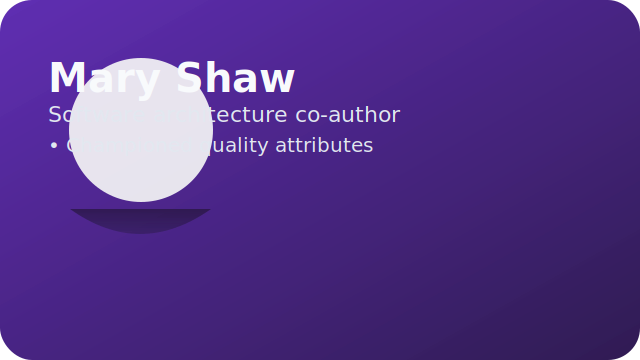

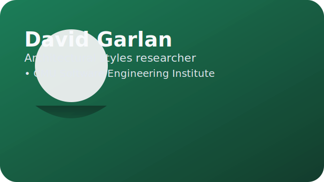

> [!IMPORTANT]
> Shaw and Garlan were not just academics—they were systems thinkers who had collaborated with industry on the U.S. Department of Defense’s **Software Engineering Institute** projects. Their obsession with quality attributes (performance, modifiability, reliability) reframed architecture conversations from “boxes and arrows” to “how do these choices feel when software is lived in over decades?”

> [!TIP]
> When you read modern architecture decision records (ADRs), you are seeing Shaw and Garlan’s influence: they advocated documenting not only what the structure is, but _why_ specific trade-offs were made.

### Cultural Backdrop

* **Y2K preparations** consumed late 1990s calendars as teams replaced two-digit year fields. The bug largely fizzled out but left behind improved testing discipline.
* **Dot-com boom and bust (1997–2001)** taught a generation that user adoption and revenue are not the same thing. When the bubble popped, many engineers learned to build leaner.
* **Fun fact:** Grady Booch, co-creator of UML, really did name his cat “Architecture,” a conversation starter at conferences.

This baseline matters because many later innovations are attempts to escape monolithic pain: slow releases, scaling bottlenecks, and opaque architecture diagrams drawn on whiteboards.

---

## 2000–2004: Processes Go Agile, Services Go Online

As the new millennium dawned, two revolutions began simultaneously: one in **process** (how we work together) and one in **architecture** (how software modules communicate).

### 2001: The Snowbird Meeting and the Agile Manifesto

In February 2001, seventeen practitioners met at the Snowbird ski resort in Utah. There was skiing by day, fireside debates by night, and eventually a 68-word statement that would alter software culture: the **Manifesto for Agile Software Development**.

* **Values.** Individuals and interactions over processes and tools; working software over exhaustive documentation; customer collaboration over contract negotiation; responding to change over following a rigid plan.
* **Principles.** Short iterations, self-organizing teams, sustainable pace, and continuous attention to technical excellence.
* **People to remember.** Kent Beck (father of Extreme Programming), Martin Fowler (thought leader at ThoughtWorks), Ward Cunningham (wiki inventor), and Jeff Sutherland (Scrum co-creator).
* **Fun story:** The attendees initially disliked the term “lightweight processes.” After much joking about being “organizational anarchists,” they settled on “Agile,” though Fowler worried Americans would pronounce it “Ag-aisle.”

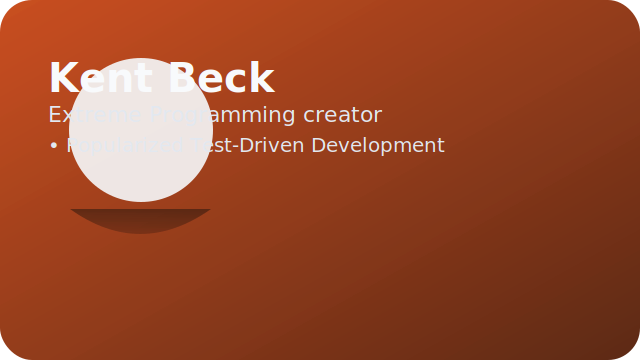

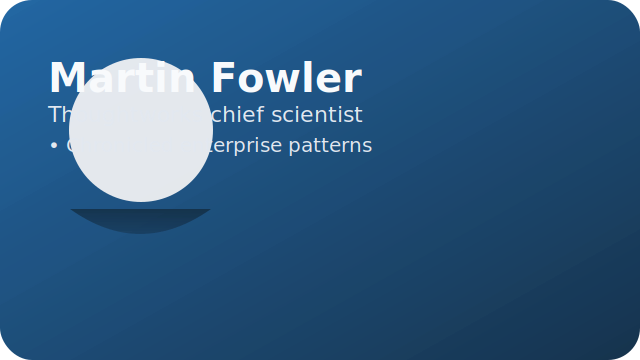


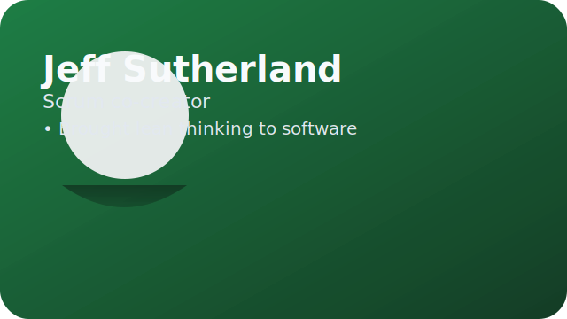

> [!NOTE]
> Each manifesto signer arrived with a different pain story. Beck wanted kinder projects after seeing developer burnout on Smalltalk teams. Fowler spent the 1990s translating academic ideas for enterprise teams and craved a vocabulary that executives would respect. Cunningham feared documentation rot and created the wiki to help communities converse in real time. Sutherland drew from lean manufacturing and his U.S. Air Force experience to give teams short feedback loops and clear missions.

```mermaid
mindmap
  root((Agile Influences))
    "Software Craftsmanship":::craft
      "Kent Beck":::craft
      "Ward Cunningham":::craft
    "Process Pragmatists":::process
      "Martin Fowler":::process
      "Alistair Cockburn":::process
    "Lean & Systems Thinking":::lean
      "Jeff Sutherland":::lean
      "Ken Schwaber":::lean
    "Toolsmiths":::tools
      "Arie van Bennekum":::tools
      "Mike Beedle":::tools
  classDef craft fill:#f97316,stroke:#7c2d12,color:#0f172a;
  classDef process fill:#047857,stroke:#064e3b,color:#ecfeff;
  classDef lean fill:#1d4ed8,stroke:#1e3a8a,color:#eff6ff;
  classDef tools fill:#7c3aed,stroke:#5b21b6,color:#ede9fe;
```

#### Key Agile Practices Explained

| Practice | What It Is | Why It Matters |
| --- | --- | --- |
| **Scrum** | Teams work in 1–4 week sprints with daily stand-ups, a product backlog, and regular retrospectives. | Creates predictable cadence and feedback loops. |
| **Extreme Programming (XP)** | Pair programming, test-driven development (TDD), continuous integration, and relentless refactoring. | Puts code quality and teamwork at the center. |
| **Kanban** | Visualizes work on a board with columns like “To Do,” “Doing,” “Done.” Limits work in progress (WIP). | Reduces context switching and exposes bottlenecks. |
| **User Stories** | Simple descriptions of features from an end-user perspective: “As a shopper, I want to save my cart so that…” | Keeps the focus on user value rather than technical tasks. |

Agile’s emphasis on small, cross-functional teams foreshadowed microservices. You cannot have dozens of teams owning independent services without an Agile culture.

### Service-Oriented Architecture (SOA) Emerges

While Agile reimagined teamwork, enterprises were slicing monoliths into **services**. **Service-Oriented Architecture (SOA)** proposed that applications should be composed of interoperable services with well-defined contracts.

* **SOAP and WSDL.** XML-based protocols describing what services offered, akin to a detailed menu.
* **Enterprise Service Bus (ESB).** A central hub handling routing, transformation, and orchestration. Think of it as a very opinionated airport control tower.
* **Pros.** Language-agnostic integration, service reuse, easier collaboration between massive departments.
* **Cons.** ESBs became performance chokepoints, XML payloads were heavy, and governance processes slowed teams.

Even though microservices later took the spotlight, their creators borrowed heavily from SOA’s dream of loose coupling.

> [!CAUTION]
> Early SOA projects sometimes replaced one big monolith with one giant Enterprise Service Bus. The lesson: distributing code without empowering teams simply moves the bottleneck.

### Virtualization and the Seeds of the Cloud

Before “cloud” became shorthand for “somebody else’s computer,” teams adopted **virtual machines** to squeeze more workloads onto the same hardware.

* **VMware ESX (1999)** and **Xen (2003)** let operators carve physical servers into multiple virtual ones.
* **Self-service provisioning** started inside enterprises via portal tickets, foreshadowing today’s cloud consoles.
* **Platform-as-a-Service prototypes** like **Salesforce (1999)** and **Heroku (2007 private beta)** hinted that developers craved opinionated environments where deployment was a `git push` away.

```bash
# Circa 2003: provisioning a new VM via command-line tools felt magical
vmware-cmd register /vmfs/volumes/app-server/app01.vmx
vmware-cmd /vmfs/volumes/app-server/app01.vmx start
```

> [!QUOTE]
> “The server is now just a file.” – common refrain among sysadmins discovering virtualization in the early 2000s.

### 2000: REST from Roy Fielding’s Thesis

Roy Fielding’s doctoral thesis at UC Irvine introduced **Representational State Transfer (REST)**, describing how the early web achieved massive scale.

> [!IMPORTANT]
> REST isn’t an API protocol. It is an architectural style built on six constraints (client–server, statelessness, cacheability, uniform interface, layered system, code-on-demand). Following these constraints lets hypermedia systems evolve without breaking clients.

#### REST vs. SOAP at a Glance

| Topic | REST | SOAP/WSDL |
| --- | --- | --- |
| Payload | Usually JSON over HTTP, lightweight. | XML envelopes with strict schemas. |
| Discoverability | Hypermedia links (HATEOAS) can guide clients. | WSDL documents define service contracts. |
| Tooling | cURL, browsers, human-readable docs. | Enterprise IDE plugins, autogenerated client stubs. |
| Typical Use | Public web APIs, mobile backends. | Enterprise integrations needing formal contracts. |

```http
GET /orders/123 HTTP/1.1
Host: api.example.com
Accept: application/json

HTTP/1.1 200 OK
Content-Type: application/json

{
  "id": 123,
  "status": "SHIPPED",
  "links": [
    { "rel": "customer", "href": "/customers/42" },
    { "rel": "tracking", "href": "https://track.example.com/abc" }
  ]
}
```

Fielding argued that uniform interfaces and hyperlinks make systems evolvable. That idea underpins today’s REST APIs, GraphQL schemas, and even event-driven contracts.

> [!HINT]
> Modern GraphQL schemas and gRPC proto files inherit REST’s obsession with contracts—just with different serialization formats and tooling.

### The Rise of Lightweight Tools and Automation

* **JUnit (1997) and xUnit family** gave developers a standardized way to write automated tests.
* **CruiseControl (2001)** and later **Hudson/Jenkins (2005)** popularized continuous integration: every commit triggers automated builds and tests, reducing “integration hell.”
* **Fun fact:** Early Jenkins builds were often run on spare desktops under people’s desks. If someone unplugged their machine to vacuum, the CI server went down.

### Social Context: After the Dot-Com Crash

Companies tightened budgets. Teams that survived the crash had to deliver value faster with fewer people—a perfect breeding ground for Agile’s collaborative, incremental mindset. Meanwhile, open-source projects such as **Apache HTTP Server** and **Eclipse IDE** cultivated communities that shared tools freely, seeding the collaborative ethos of later DevOps movements.

---

## 2005–2009: Web 2.0, Rails, and the Dawn of the Cloud

By the mid-2000s, software was no longer just enterprise back-office tooling. Social networks, user-generated content, and always-on web apps demanded architectures that could evolve rapidly.

### Web 2.0 and the Era of Rich Internet Applications

**Ajax (Asynchronous JavaScript and XML)** allowed web pages to update without full reloads. Applications like Gmail (2004) and Google Maps (2005) set new expectations for responsiveness.

* **Impact on architecture:** Backends now needed APIs to serve dynamic data to JavaScript-heavy front-ends, pushing RESTful designs mainstream.
* **Mashups:** Developers combined data from multiple APIs (e.g., plotting Craigslist apartments on Google Maps), forcing companies to publish clean interfaces.
* **Fun fact:** The term “Web 2.0” was popularized by Tim O’Reilly. His conferences gave rise to the idea that the web is a platform, not a set of static pages.

### Ruby on Rails and “Convention over Configuration”

In 2004, **David Heinemeier Hansson** extracted Ruby on Rails from the Basecamp project. Rails championed:

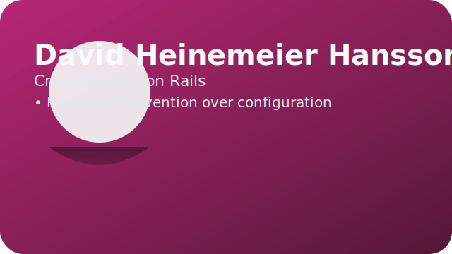

> [!INFO]
> Hansson was a Danish student fascinated by both design and racing. His frustration with Java boilerplate and PHP hacks pushed him to craft a framework that let one developer ship polished products in days. Rails’ philosophy—embracing sensible defaults like RESTful routes and Model-View-Controller (MVC) scaffolding—made architecture approachable for startups that could not afford giant platform teams.

* **Model-View-Controller (MVC)** structure by default.
* **Convention over configuration.** If you name your database table `users`, Rails will assume the model class is `User`. Less boilerplate.
* **Scaffolding generators.** With a single command, developers spun up CRUD interfaces, letting startups prototype in days.
* **RESTful routes.** Rails made HTTP verbs first-class citizens, accelerating the decline of SOAP in the consumer web.

**Twitter** launched on Rails in 2006, scaling issues and all. Although they eventually migrated critical pieces to the JVM and microservices, Rails proved that expressive frameworks can jumpstart innovation.

```bash
# 2006 startup energy distilled into two commands
$ rails new microblog
$ rails generate scaffold Post title:string body:text published:boolean
```

> [!TIP]
> Rails’ opinionated defaults inspired later ecosystems: Laravel for PHP, Spring Boot for Java, and Next.js for JavaScript all embrace “happy paths” that trade flexibility for velocity.

### Dynamic Languages Rise

* **Python** gained momentum through Django (2005), a batteries-included web framework.
* **PHP** powered WordPress (2003) and Facebook (2004), demonstrating that simple tooling could scale with clever engineering.
* **JavaScript** escaped the browser with Node.js by 2009 (using Google’s V8 engine), setting the stage for server-side JavaScript and full-stack JS teams.

### 2006: Amazon Web Services (AWS) Launches EC2 and S3

In 2006, Amazon unveiled **Elastic Compute Cloud (EC2)** and **Simple Storage Service (S3)**. For the first time, developers rented virtual servers by the hour and storage by the gigabyte.

* **Elasticity.** Spin up servers when traffic spikes; shut them down when it drops. No more buying hardware months in advance.
* **APIs for infrastructure.** Infrastructure became programmable, a radical shift from filing tickets for new machines.
* **“Everything fails, all the time.”** Werner Vogels, Amazon CTO, emphasized designing for failure. Outages were inevitable; architectures should absorb them.
* **S3 durability.** Amazon promised “eleven nines” (99.999999999%) durability. The idea that storage could be effectively immortal fascinated developers.

Early adopters like **Netflix** saw the cloud as a chance to leave costly data centers. Others were skeptical—security, compliance, and vendor lock-in debates began immediately and have never fully ended.

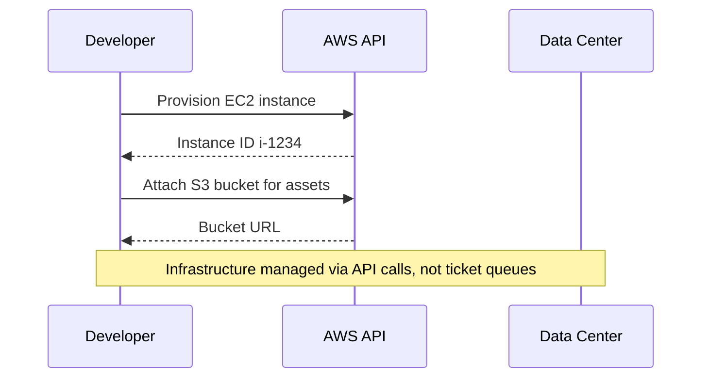

> [!WARNING]
> Teams that “lifted and shifted” monoliths to the cloud without automation often spent more money than on-premises. Cloud economics reward elasticity and automation—not forklifting servers into VMs.

### The First Steps Toward DevOps

* **Patrick Debois** coined the term **DevOps** in 2009 after organizing a conference called “DevOpsDays” in Ghent, Belgium. He was frustrated by the wall between developers (who build features) and operations teams (who keep systems running).
* **Configuration management tools** like Chef (2009) and Puppet (2005) automated server setup via code. Instead of “golden images,” teams wrote recipes.

DevOps bridged Agile’s collaborative mindset with the operational realities of running large-scale systems.

### Security and Reliability Lessons

* **The 2003 SQL Slammer worm** exploited unsecured SQL Server instances, leading to widespread outages. Architects learned to plan for security from the design phase.
* **Google’s Site Reliability Engineering (SRE) team** was publishing internal reliability practices. Later, their 2016 SRE book would influence the entire industry.

### Cultural Tidbit: Napster to BitTorrent

Napster (1999) and later BitTorrent (2001) popularized **peer-to-peer (P2P)** architecture. While primarily used for file sharing, the idea that computation and data could live on the edge rather than in central servers foreshadowed blockchain and edge computing concepts.

---

## 2010–2014: DevOps, Microservices, and the Container Craze

The 2010s opened with smartphones everywhere, SaaS dominating budgets, and companies needing to deploy features multiple times per day. Architecture had to keep up.

### Continuous Delivery and DevOps Take Center Stage

In 2010, Jez Humble and David Farley published **_Continuous Delivery_**, describing pipelines that automatically build, test, and deploy software. This book turned DevOps from a slogan into a practice.

* **CI/CD pipelines** became standard. Jenkins jobs triggered unit tests, integration tests, packaging, and deployment to staging.
* **Infrastructure as Code (IaC).** Tools like **Terraform (2014)** and **AWS CloudFormation (2011)** let teams declare infrastructure in version-controlled files.
* **ChatOps.** Teams used chat tools (e.g., HipChat, later Slack) to run deployments via bots, making operations collaborative and transparent.


### Microservices Enter the Scene

**Microservices** are small, independently deployable services that together form an application. While the concept evolved gradually, two moments stand out:

1. **2011:** Amazon’s internal memo from CEO Jeff Bezos mandated that all teams expose data and functionality through service interfaces. This “Bezos API Mandate” forced modularity and service communication.
2. **2012–2013:** **Adrian Cockcroft** at Netflix evangelized microservices, sharing how they split their streaming platform into dozens of autonomous services. Talks at QCon and blog posts ignited industry-wide adoption.

#### Why Microservices?

* Independent deployments reduce blast radius.
* Teams can choose technology stacks (polyglot programming).
* Easier horizontal scaling of hot services.

#### Challenges

* Distributed systems are hard: network latency, partial failures, and eventual consistency.
* Observability (logs, metrics, traces) became a must.
* Requires mature DevOps culture; otherwise complexity skyrockets.

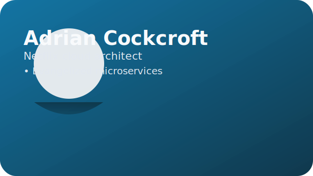

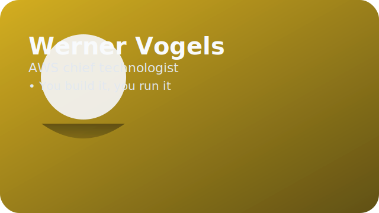

> [!TIP]
> Vogels’ “two-pizza teams” mantra at Amazon and Cockcroft’s storytelling at Netflix humanized microservices. They pushed for small, empowered groups that own services end-to-end, not because it was trendy, but because they had lived through pager fatigue when monoliths failed at 3 a.m. Their talks connected culture (autonomy, accountability) with architecture (service boundaries, automated recovery).

### 2013: Docker Sparks the Container Revolution

**Docker**, introduced at PyCon 2013 by Solomon Hykes, packaged applications with their dependencies into lightweight containers.

* **Images and containers.** Developers build an image once; operations run identical containers anywhere (developer laptop, test server, production cluster).
* **Immutable infrastructure.** Instead of patching servers, teams redeploy new containers.
* **Portability.** Containers run on Windows, Linux, and Mac (with virtualization layers).

Docker’s meteoric rise led to a new ecosystem: container registries, orchestration tools, and DevSecOps practices.

```Dockerfile
# 2014-era microservice
FROM python:3.8-slim
WORKDIR /app
COPY requirements.txt ./
RUN pip install -r requirements.txt
COPY . .
EXPOSE 8000
CMD ["gunicorn", "service:app", "--bind", "0.0.0.0:8000"]
```

> [!SUCCESS]
> Reproducibility became table stakes. “It works on my machine” stopped being an acceptable excuse once teams could ship the machine.

### 2014: Kubernetes and the Orchestrated Cloud

Google open-sourced **Kubernetes** (built on their internal Borg system) in 2014. Kubernetes schedules containers across clusters, handles service discovery, load balancing, and self-healing.

* **Declarative model.** Developers describe the desired state (e.g., “three replicas of this service”). Kubernetes reconciles reality to match.
* **Service mesh roots.** Projects like Istio later added traffic management, retries, and observability.
* **Fun fact:** Kubernetes’ logo has seven spokes representing the seven letters of “Borg.” The project’s mascot is a friendly ship’s wheel.

```yaml
# A minimal Deployment manifest circa 2015
apiVersion: apps/v1
kind: Deployment
metadata:
  name: checkout-service
spec:
  replicas: 3
  selector:
    matchLabels:
      app: checkout
  template:
    metadata:
      labels:
        app: checkout
    spec:
      containers:
        - name: checkout
          image: ghcr.io/example/checkout:v1.2.0
          ports:
            - containerPort: 8080
```

> [!QUESTION]
> Why was Kubernetes necessary if Docker Compose already orchestrated containers? Because global companies needed scheduling, self-healing, and cluster-level APIs that Compose could not provide.

### Architectural Patterns of the Era

| Pattern | Summary | Example |
| --- | --- | --- |
| **Circuit Breaker** | Temporarily stop calls to a failing service to prevent cascading failures. | Netflix Hystrix library (2012). |
| **Bulkhead** | Isolate components so failure in one doesn’t sink the entire system. | Partitioning thread pools or containers. |
| **API Gateway** | A single entry point that routes and secures microservice calls. | Kong, Amazon API Gateway. |
| **Event-Driven Architecture** | Services publish and subscribe to events via message brokers. | Apache Kafka (created at LinkedIn, open-sourced 2011). |

### Site Reliability Engineering (SRE)

Google’s SRE organization formalized practices such as error budgets, service level objectives (SLOs), and blameless postmortems. By 2014, other companies adopted the SRE mindset, blending software engineering with operations reliability.

> [!TIP]
> SRE reframed outages as engineering problems, not operator failures. If you could not automate a runbook, you had not solved the problem yet.

### Mobile and Cross-Platform Development

* **iOS and Android app stores** (launched 2008) matured. Architects had to think in terms of APIs that served both web and mobile clients.
* **Backend-as-a-Service (BaaS)** providers like Parse and Firebase offered ready-made backends for mobile developers, showing that not everything needed to be built in-house.

### Culture and Anecdotes

* **DevOpsDays spread** from Belgium to the US, Europe, and Asia, becoming a global movement.
* **Netflix Chaos Monkey (2011)** randomly terminated instances in production to test resilience. Their “Simian Army” suite later added tools like Latency Monkey and Security Monkey.
* **Fun fact:** Etsy popularized the term “Full Stack Engineer” as developers needed to understand both backend and frontend changes for rapid releases.

---

## 2015–2019: Cloud-Native Maturity and the Age of Observability

By 2015, cloud adoption was mainstream, microservices were widely accepted, and teams searched for better ways to manage complexity.

### Cloud-Native Landscape

The **Cloud Native Computing Foundation (CNCF)** launched in 2015 to host Kubernetes and related projects. Cloud-native architectures embrace containers, dynamic orchestration, and declarative APIs.

* **CNCF Landscape Map.** A sprawling interactive map of tools (service meshes, tracing, databases). Browsing it feels like navigating a densely packed galaxy.
* **Twelve-Factor App.** Heroku engineers summarized best practices for SaaS apps: stateless processes, config in environment variables, logs as event streams.

### Observability Becomes Critical

As systems distributed across dozens of services, traditional monitoring (CPU, memory graphs) wasn’t enough.

* **Logs, metrics, traces** – the “three pillars.” Tools like **ELK Stack (Elasticsearch, Logstash, Kibana)**, **Prometheus (2015)**, and **Jaeger (2017)** emerged.
* **OpenTracing (2016)** and later **OpenTelemetry (2019)** standardized instrumentation.
* **Service Level Objectives (SLOs)** quantified reliability expectations (e.g., 99.9% availability). Error budgets guided release decisions.


> [!QUOTE]
> “Monitoring is asking the system the questions you thought to pose. Observability is the ability to ask new ones.” — Charity Majors.

> [!TIP]
> Majors’ experience running production databases at Parse (acquired by Facebook) convinced her that dashboards alone could not explain complex outages. She co-founded Honeycomb to give engineers interactive tools for debugging “unknown unknowns,” shifting architecture conversations toward rich event data and high-cardinality analysis.

```yaml
# Example Prometheus alert (2018 vintage)
groups:
  - name: checkout-latency
    rules:
      - alert: CheckoutP95TooHigh
        expr: histogram_quantile(0.95, sum(rate(http_request_duration_seconds_bucket{service="checkout"}[5m])) by (le)) > 1.5
        for: 10m
        labels:
          severity: page
        annotations:
          summary: "Checkout latency p95 exceeded 1.5s"
```

> [!WARNING]
> Monitoring tells you when the house is on fire; observability tells you which candle tipped over. Distributed tracing and high-cardinality logs became survival tools for microservice sprawl.

### Serverless Computing Takes Off

* **AWS Lambda (2014)** popularized **Function-as-a-Service (FaaS)**. Developers upload small functions that run in response to events.
* **Benefits.** No server management, automatic scaling, pay-per-invocation.
* **Challenges.** Cold starts, limited execution time, debugging complexity, and vendor-specific tooling.
* **Edge serverless** services (Cloudflare Workers, AWS Lambda@Edge) pushed computation closer to users for low-latency tasks.

```javascript
// Example Lambda handler (Node.js 8 era)
exports.handler = async (event) => {
  const body = JSON.parse(event.body || '{}');
  const total = body.items?.reduce((sum, item) => sum + item.price, 0) ?? 0;
  return {
    statusCode: 200,
    headers: { 'Content-Type': 'application/json' },
    body: JSON.stringify({ total, generatedAt: new Date().toISOString() })
  };
};
```

> [!TIP]
> Serverless changed cost discussions. Finance teams learned new words—**FinOps**, **unit economics**, **cost allocation**—to keep runaway invocation bills in check.

### Data Engineering and Streaming

* **Apache Kafka** evolved into a distributed streaming platform with Kafka Streams and ksqlDB.
* **Apache Spark** (2014) unified batch and stream processing with in-memory computation.
* **Data lakes** on S3 or Hadoop became popular for storing raw data cheaply.

### Organizational Thinking Evolves

* **Team Topologies (2019)** by Matthew Skelton and Manuel Pais described four team types—stream-aligned, enabling, complicated subsystem, and platform—and three interaction modes. The goal: reduce cognitive load.
* **Platform engineering** teams created paved roads (internal developer portals, self-service infrastructure) so product teams could focus on business logic.
* **DevSecOps** integrated security into pipelines. Tools like HashiCorp Vault, static analysis (Snyk), and dependency scanners mitigated supply chain risks.

### Domain-Driven Design (DDD) Resurgence

Eric Evans’ 2003 book gained fresh relevance. Concepts like **bounded contexts** and **ubiquitous language** helped teams align microservices with business domains. Strategic design workshops (“Event Storming”) became common during system rewrites.

### Real-World Case Studies

* **Spotify Model.** Squads, tribes, chapters, and guilds—a cultural framework for autonomous teams. Although Spotify later clarified it was more inspiration than blueprint, many companies adopted similar structures.
* **Uber and Lyft** rapidly iterated their ride-sharing platforms, facing challenges in real-time dispatch, surge pricing, and global scale. Their architectures combined microservices with event-driven pipelines.
* **Shopify** championed the “modular monolith,” showing that carefully designed monoliths remain viable when combined with strong testing and CI/CD.

### Fun Bits

* **Docker’s whale mascot, Moby Dock,** became a popular conference plushie.
* **Google’s SRE book (2016)** revealed that error budgets often lead to release freezes—if reliability dips below the target, teams pause features to fix stability.
* **Chaos Engineering** matured. Netflix open-sourced **Chaos Monkey** (2011), later joined by tools like **Gremlin** and **Chaos Mesh**.

---

## 2020–2025: AI Everywhere, Edge Computing, and Responsible Tech

The 2020s accelerated every trend: remote work, automation, AI integration, and ethical scrutiny.

### Pandemic-Driven Shifts

* **Remote-first work.** Collaboration tools (Zoom, Teams, Slack, Miro) became mission-critical. Architectures needed secure remote access and zero-trust networking.
* **GitOps.** Deployments executed via pull requests using tools like Argo CD and Flux. This made operations auditable and friendly to distributed teams.
* **Resilience focus.** Cloud capacity planning, incident response runbooks, and observability dashboards became lifelines.

```yaml
# GitOps pull-request workflow (GitHub Actions example)
name: deploy
on:
  pull_request:
    branches: [ "main" ]
jobs:
  reconcile:
    runs-on: ubuntu-latest
    steps:
      - uses: actions/checkout@v3
      - name: Render manifests
        run: kustomize build overlays/prod > rendered.yaml
      - name: Submit to Argo CD
        run: argocd app set storefront --file rendered.yaml --async
```

> [!NOTE]
> When teams went remote overnight, the deployment button moved into chat rooms and pull requests. Documentation, runbooks, and pipelines had to be readable by bleary-eyed teammates across time zones.

### Machine Learning Operationalized (MLOps)

* **Software 2.0.** Andrej Karpathy described neural networks as “programs” learned from data. Developers curated datasets and training pipelines rather than writing rules by hand.
* **MLOps pipelines** covered data ingestion, feature engineering, model training, deployment, and monitoring. Platforms like **MLflow, Kubeflow, and TFX** standardized workflows.
* **Feature stores** (e.g., Feast) ensured consistent features between training and inference.
* **Model monitoring.** Tools detected data drift (input changes) and concept drift (behavior changes). Continuous retraining became normal.

### Generative AI and LLMs

* **GPT-3 (2020), GPT-4 (2023), and successors** demonstrated that large language models (LLMs) can write prose, code, and marketing copy.
* **Developer tools** such as **GitHub Copilot, Replit Ghostwriter, and Amazon CodeWhisperer** integrated AI into IDEs, boosting productivity but raising questions about licensing and trust.
* **Architecture impact.** Systems integrated LLM APIs with prompt engineering layers, caching strategies, and guardrails to prevent inappropriate output.
* **Vector databases** (Pinecone, Weaviate, Milvus) stored embeddings for semantic search, enabling retrieval-augmented generation.
* **Ethics.** Bias mitigation, explainability dashboards, and human-in-the-loop review became non-negotiable in regulated industries.

```python
# Retrieval-augmented generation (RAG) skeleton
import openai
from vectordb import search

def answer(question: str):
    docs = search(question, top_k=3)
    context = "\n".join(docs)
    prompt = f"""
    You are a release engineer. Use the context to answer the question.
    Context:\n{context}\nQuestion: {question}
    """
    response = openai.ChatCompletion.create(
        model="gpt-4",
        messages=[{"role": "user", "content": prompt}],
        temperature=0.2
    )
    return response["choices"][0]["message"]["content"]
```

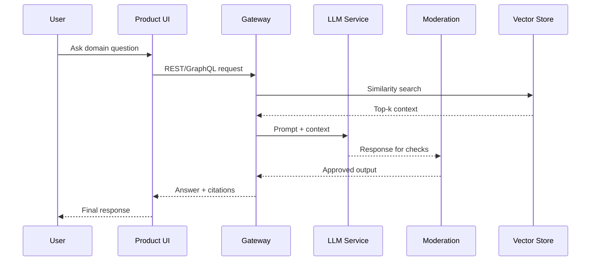

> [!DANGER]
> Generative AI raises new failure modes: hallucinated facts, prompt injection, data leakage. Responsible design means pairing LLMs with safeguards, audit logs, and fallback experiences.

### Data Mesh and Product Analytics

* **Data Mesh (Zhamak Dehghani, 2019–2021)** reframed analytics architecture as federated, domain-oriented data products instead of centralized lakes.
* **Experimentation platforms** (Netflix XP, Airbnb’s ERF, Shopify’s Delorean) industrialized A/B testing and causal inference.
* **Privacy-first analytics** tools embraced differential privacy and local-first telemetry to balance insights with compliance.

> [!TIP]
> If microservices gave domains ownership of code, data mesh extended that ownership to analytical datasets—complete with discoverable catalogs and quality SLAs.

### Edge Computing and Internet of Things (IoT)

* **5G networks** reduced latency, making it practical to process data near the source.
* **Edge devices** (smart cameras, industrial sensors) ran models locally using frameworks like **TensorFlow Lite** and **ONNX Runtime**.
* **Use cases.** Autonomous vehicles, smart factories, augmented reality games, telemedicine.
* **Hybrid architectures.** Data processed locally for real-time decisions, with summaries synced to the cloud for analytics.

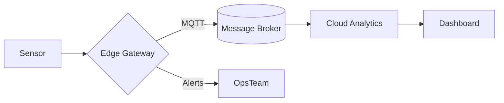

### Post-Microservices Reflection

After a decade of microservice enthusiasm, many companies reconsidered.

| Approach | When It Shines | Trade-offs |
| --- | --- | --- |
| **Modular Monolith** | Small teams, tightly coupled domains, simpler deployments. | Requires discipline to avoid spaghetti code. |
| **Right-Sized Microservices** | Large organizations with independent business domains. | Needs robust observability and platform support. |
| **Event-Driven Architectures** | Systems needing decoupling and real-time reactions. | Harder debugging; requires schema governance. |
| **Service Mesh & Platform Engineering** | Standardizing networking, security, and observability. | Adds layers of abstraction; platform teams become essential. |

A famous example: **Amazon Prime Video** shared in 2023 that a microservices-for-everything approach introduced excessive overhead, so they consolidated video workflow services back into a “monolith” deployed on containers. The lesson: architecture should follow the problem, not fashion.

### Security, Privacy, and Compliance

* **Zero Trust Architecture.** Assume no implicit trust on networks; every request is authenticated and authorized.
* **Supply Chain Security.** Incidents like SolarWinds (2020) spurred frameworks like **SLSA** (Supply-chain Levels for Software Artifacts) and tools like **Sigstore** for signing binaries.
* **Privacy regulations.** GDPR (Europe), CCPA (California), and China’s PIPL imposed strict data-handling rules. Architects plan for data residency, consent tracking, and anonymization.

### Sustainability and Green Software

* **Green Software Foundation (2021)** promoted measuring carbon intensity of workloads.
* **Carbon-aware computing.** Workloads shifted to regions with renewable energy or scheduled during low-carbon hours.
* **Efficiency by design.** Serverless and autoscaling reduced idle resources; developers optimized algorithms for lower CPU and memory usage.

### Cultural Notes and Anecdotes

* **Blameless postmortems** became standard after outages, reinforcing psychological safety.
* **Platform engineering conferences** emerged, sharing templates for internal developer portals.
* **Low-code/no-code tools** empowered “citizen developers” to build automations. Fusion teams blended professional developers with domain experts to balance speed and governance.
* **Fun fact:** Some companies schedule “Game Days” where teams intentionally break systems to practice incident response—chaos engineering as a team sport.

> [!SUCCESS]
> Internal developer platforms became the new interface for architecture. Instead of opening tickets, engineers visited self-service portals, clicked “Provision sandbox cluster,” and had environments minutes later.

---

## Putting It All Together: Key Patterns and Timeless Lessons

### Timeline Highlights

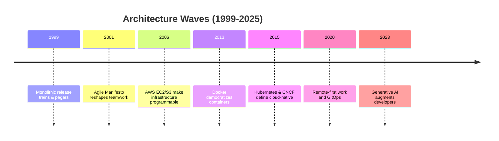

| Year | Milestone | Why It Matters |
| --- | --- | --- |
| 1994 | _Design Patterns_ book | Established reusable vocabulary. |
| 1999 | Extreme Programming | Introduced TDD, pair programming. |
| 2001 | Agile Manifesto | Shifted focus to people and adaptability. |
| 2004 | Ruby on Rails | Mainstreamed MVC web frameworks and RESTful routes. |
| 2006 | AWS EC2/S3 | Made infrastructure programmable and elastic. |
| 2009 | DevOps coined | United development and operations cultures. |
| 2012 | Netflix microservices talks | Demonstrated independent service deployment at scale. |
| 2013 | Docker | Standardized container packaging. |
| 2015 | CNCF founded | Formalized “cloud-native” tooling ecosystem. |
| 2017 | Service meshes | Added reliability and security layers for microservices. |
| 2020 | GPT-3 | Signaled AI’s leap into mainstream developer tooling. |
| 2021 | GitOps adoption | Declarative operations via pull requests. |
| 2023 | Prime Video “remonolith” | Reminder that simplicity sometimes wins. |

### Architectural Principles That Endure

1. **Start with people and teams.** Architecture mirrors communication structures (Conway’s Law). Cross-functional teams with shared goals outpace silos.
2. **Automate relentlessly.** CI/CD, infrastructure as code, and GitOps reduce human error and accelerate feedback.
3. **Design for failure.** Assume networks flake out, servers crash, and dependencies misbehave. Resilience patterns like circuit breakers and retries are your friends.
4. **Observe everything.** Logging, metrics, and tracing provide the narrative when incidents occur. Without observability, distributed systems are black boxes.
5. **Right-size the solution.** Microservices, monoliths, serverless, event-driven—each has a sweet spot. Choose based on team size, domain complexity, and operational maturity.
6. **Secure by design.** Shift security left. Automate scans, enforce least privilege, and plan for compliance early.
7. **Keep learning.** The story of software architecture is one of continuous iteration. Be ready to adopt new patterns—and retire old ones—when the context changes.

### Human Stories

* **Kent Beck** teaching small talk (the language) during the day and practicing pair programming at night to refine XP.
* **Adrian Cockcroft** giving microservices talks wearing Hawaiian shirts, emphasizing culture alongside tech.
* **Charity Majors** (Honeycomb co-founder) popularizing the term “observability” and urging teams to “own your operations.”
* **Werner Vogels** repeating his mantra “you build it, you run it,” reinforcing the DevOps ethos at AWS.

These anecdotes remind us that architecture is deeply human: creativity, collaboration, and sometimes stubbornness drive progress as much as code does.

---

## Suggested Films, Books, and Talks for Further Exploration

* **Books**
  * _The Mythical Man-Month_ by Frederick Brooks – Classic essays on project management and the pitfalls of adding people to late projects.
  * _Extreme Programming Explained_ by Kent Beck – The book that humanized programming practices.
  * _Continuous Delivery_ by Jez Humble and David Farley – Blueprint for CI/CD pipelines.
  * _Building Microservices_ by Sam Newman – Practical guide to decomposing systems.
  * _Team Topologies_ by Matthew Skelton and Manuel Pais – Modern organizational design for tech teams.
  * _Accelerate_ by Nicole Forsgren, Jez Humble, and Gene Kim – Research-backed look at DevOps metrics.

* **Talks & Documentaries**
  * “**The Twelve-Factor App**” (Heroku) – Short guide to SaaS best practices.
  * Adrian Cockcroft’s Netflix architecture talks (QCon 2012+) – Microservices in action.
  * Google SRE talks from SREcon – Deep dives into reliability engineering.
  * Chaos Engineering sessions from Netflix and Gremlin – Learning from failure.
  * “**Rise of the Developer Experience Engineer**” – Talks on platform engineering and internal developer portals.

* **Films/Series for Inspiration**
  * _Halt and Catch Fire_ (AMC) – Dramatized history of computing, capturing the passion behind technology leaps.
  * _The Social Network_ – Snapshot of early Facebook and the cultural momentum of web startups.
  * _General Magic_ (documentary) – Story of a 1990s company that imagined smartphones before the world was ready.

---

## Glossary of Core Terms

* **API (Application Programming Interface):** A contract that allows software components to communicate. RESTful APIs use HTTP verbs; GraphQL and gRPC are newer alternatives.
* **Blameless Postmortem:** A meeting after an incident focusing on learning, not blame. Encourages honesty and systemic fixes.
* **Chaos Engineering:** Deliberately injecting failures (like shutting down servers or adding latency) to verify a system’s resilience and to build operator confidence.
* **CI/CD (Continuous Integration/Continuous Delivery):** Automated processes that build, test, and deploy code whenever developers commit changes.
* **Container:** A lightweight package with an application and its dependencies. Docker popularized them; Kubernetes orchestrates them.
* **DevOps:** Cultural and technical movement that unites development and operations to deliver software quickly and reliably.
* **Edge Computing:** Processing data close to where it is generated (e.g., on devices or local gateways) to reduce latency.
* **Event-Driven Architecture:** Systems that react to events (messages) rather than synchronous requests. Enables loose coupling.
* **FinOps:** A discipline that brings together finance, engineering, and product teams to manage cloud spending without slowing down delivery.
* **Function-as-a-Service (FaaS):** Cloud offering where individual functions execute in response to events; billing is per invocation.
* **GitOps:** Managing infrastructure and deployments through Git repositories and automated reconciliation.
* **High-Cardinality Data:** Telemetry with many possible values (like user IDs or request IDs) that helps pinpoint specific issues in observability systems.
* **Infrastructure as Code (IaC):** Managing infrastructure through declarative files and automation tools instead of manual console work.
* **Lean Manufacturing / Lean Thinking:** Management philosophy focused on eliminating waste and amplifying learning; inspired Agile practices like Scrum and Kanban.
* **Microservices:** Architectural style where applications comprise small, independently deployable services.
* **Model-View-Controller (MVC):** UI pattern separating data (model), presentation (view), and input handling (controller); central to frameworks like Rails.
* **Monolith:** Single deployable unit containing an entire application. Opposite of microservices.
* **Observability:** Ability to understand a system’s internal state from external outputs (logs, metrics, traces).
* **Platform Engineering:** Building internal platforms (portals, pipelines, self-service tooling) that give product teams paved roads for delivery.
* **Representational State Transfer (REST):** A style of designing networked APIs using standard HTTP verbs (GET, POST, PUT, DELETE) and stateless communication.
* **Service Mesh:** Infrastructure layer that adds traffic routing, security, and observability between microservices without changing application code.
* **SLO (Service Level Objective):** Target reliability metric (e.g., 99.95% uptime). Error budgets quantify allowable downtime.
* **SOLID Principles:** Five design guidelines (Single Responsibility, Open/Closed, Liskov Substitution, Interface Segregation, Dependency Inversion) for maintainable code.
* **SOA (Service-Oriented Architecture):** Architectural style emphasizing reusable services with standardized contracts, often using SOAP.
* **Software Engineering Institute (SEI):** Carnegie Mellon research center that produced early software architecture frameworks and maturity models.
* **Technical Debt:** The implied cost of rework caused by choosing faster, less clean solutions now instead of better approaches that take longer.
* **Zero Trust:** Security model assuming no implicit trust; every request is authenticated and authorized.

---

### Final Thoughts

Software architecture from 1999 to 2025 is a tapestry woven from people, ideas, failures, and triumphs. As you explore modern technologies—whether deploying a serverless function, instrumenting a distributed trace, or prompting an AI assistant—remember the pioneers who skied at Snowbird, wrangled XML in early SOA projects, hacked together the first container runtimes, or stayed up late restoring services during global outages. Architecture is living history, and you are now part of the next chapter.

